# Vehicle Detection Project

<figure>
 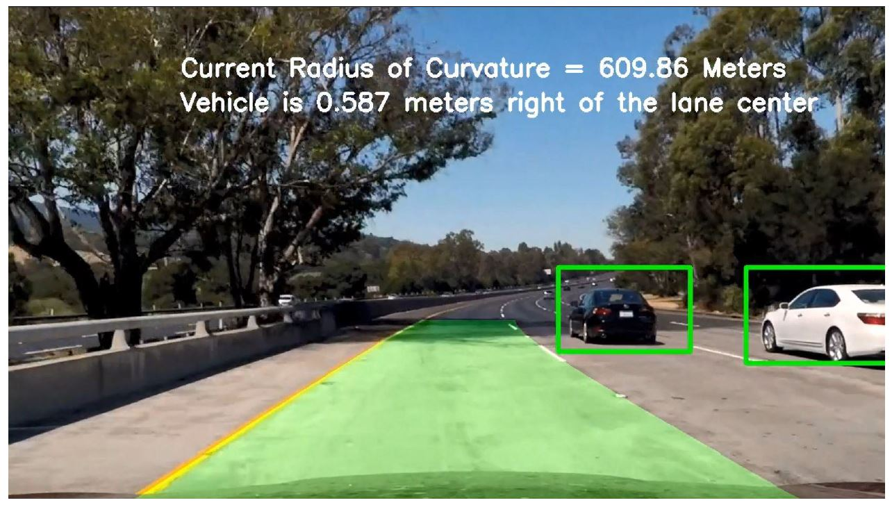
 <figcaption>
 

 
 </figcaption>
</figure>
   
## The goals / steps of this project are the following:
- Perform a Histogram of Oriented Gradients (HOG) feature extraction on a labeled training set of images and train a classifier Linear SVM classifier
- Optionally, you can also apply a color transform and append binned color features, as well as histograms of color, to your HOG feature vector.
- Note: for those first two steps don't forget to normalize your features and randomize a selection for training and testing.
- Implement a sliding-window technique and use your trained classifier to search for vehicles in images.
- Run your pipeline on a video stream (start with the test_video.mp4 and later implement on full project_video.mp4) and create a heat map of recurring detections frame by frame to reject outliers and follow detected vehicles.
- Estimate a bounding box for vehicles detected.

---

## Rubric Points
- **Histogram of Oriented Gradients (HOG)**
   - **1. Explain how (and identify where in your code) you extracted HOG features from the training images. Firstly, I loaded all the needed data, as follows:**
      - 1- GTI data. 
      - 2- KITTI data set. 
      - 3- The Extra data provided by Udacity. 
      - And got two lists for vehicles & non vehicles. Then I explored random samples of these data in different color spaces as this step may help roughly estimate which color space will give powerful features. 
      
         - 1- YCrCb
         <figure>
          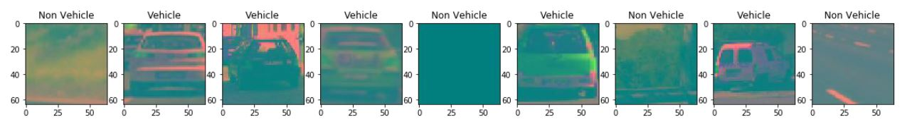
          <figcaption>
          

 
          </figcaption>
         </figure>
         
         - 2- LUV
         <figure>
          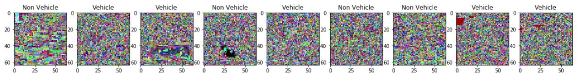
          <figcaption>
          

 
          </figcaption>
         </figure>     
         
         - 3- YUV
         <figure>
          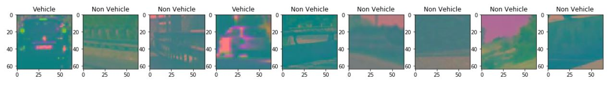
          <figcaption>
          

 
          </figcaption>
         </figure>    
         
         - 4- HLS
         <figure>
          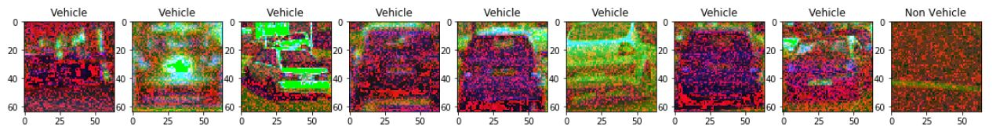
          <figcaption>
          

 
          </figcaption>
         </figure>  
         
         - 5- HSV
         <figure>
          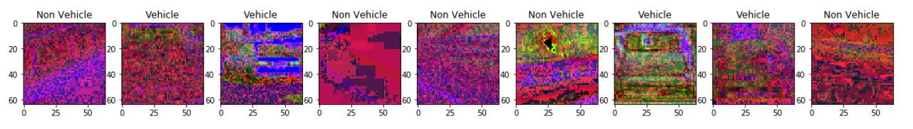
          <figcaption>
          

 
          </figcaption>
         </figure>    
         
         - 6- RGB
         <figure>
          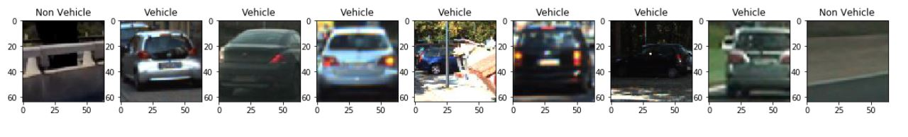
          <figcaption>
          

 
          </figcaption>
         </figure> 
---

      - **HOG Features Exploration**
         - I then explored different skimage.hog() parameters (orientations, pixels_per_cell, and cells_per_block). I grabbed random images from each of the two classes and displayed them to get a feel for what the skimage.hog() output looks like.
         Here is an example using the HLS color space and HOG parameters of orientations=9 & 12, pixels_per_cell=(8, 8) and cells_per_block=(2, 2):
         
         <figure>
          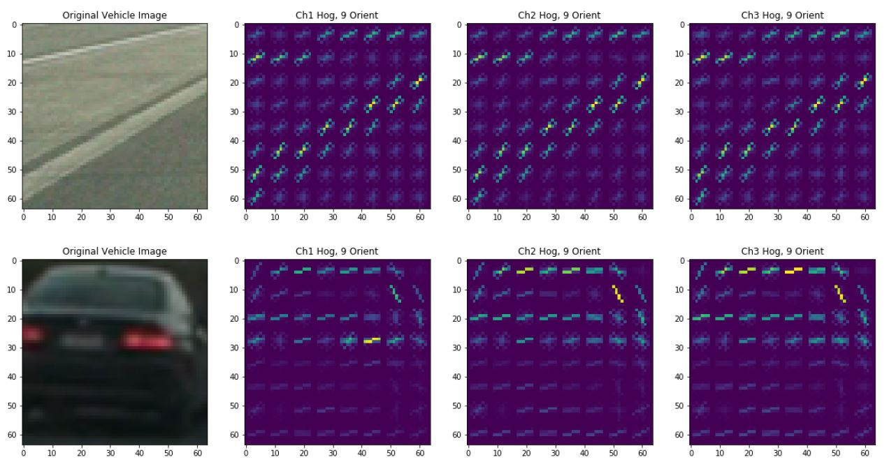
          <figcaption>
          

 
          </figcaption>
         </figure> 

         <figure>
          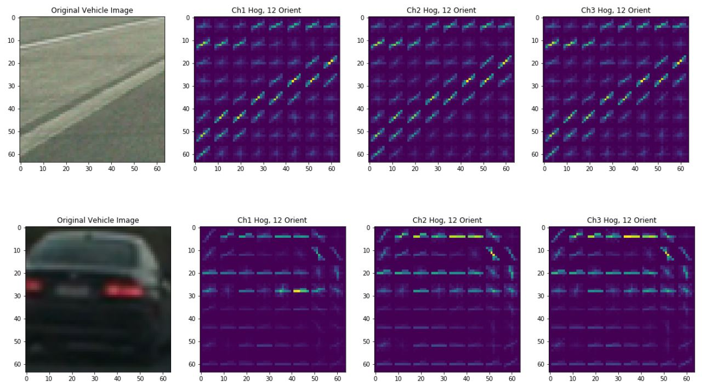
          <figcaption>
          

 
          </figcaption>
         </figure>          
         
         
      - **2. Explain how you settled on your final choice of HOG parameters.**
         - I’ve tried many various combinations of parameters and color spaces and spatial sizes binning as shown in my pipeline in Training Approaches section, I’ve tried 6 different parameters combination and then visualized and analyzed their results on both test images and different test clips from the project video in terms of:
            - 1- SVM Model Test Accuracy.
            - 2- Positive Detections.
            - 3- Detections Stability.
            - 4- False Positives Detections.
            - 5- False Negative Detections.
         - Below are examples of each approach results on the test images set.
         
   - 3. Describe how (and identify where in your code) you trained a classifier using your selected HOG features (and color features if you used them). 
   - Refer for “Different Approaches Used To Address The Vehicle Detection Problem” section in my project notebook.
   
   - I’ve trains SVM model using a combination of three main features for each image:
      1- Raw Pixel Values.
      2- HOG.
      3- Histogram of Pixel Values.
      
   - As per Training Approaches section I’ve trained six SVM models with six different combinations of features and the test accuracies were as follow:
   
      1- SVM and LUV:
         - The Parameters here are as follows:
            - Color space = LUV
            - Hog Orientations = 9
            - Spatial Size = (16, 16)
            - Cells Per Block = 2
            - Pixels Per Block = 8
            - Histogram Bins = 32
            - Window Scale = 1, 1.5
         - Feature vector length: 6156 12.52 Seconds to train SVC... Test Accuracy of SVC = 0.9851
      
      2- SVM and RGB:
         - The Parameters here are as follows:
            - Color Space = RGB
            - Hog Orientations = 9
            - Spatial Size = (16, 16)
            - Cells Per Block = 2
            - Pixels Per Block = 8
            - Histogram Bins = 32
         - Window Scale = 1, 1.5 Feature vector length: 6156 14.24 Seconds to train SVC... Test Accuracy of SVC = 0.9761
         
      3- SVM and HLS:
         - The Parameters here are as follows:
            - Color Space = HLS
            - Hog Orientations = 9
            - Spatial Size = (16, 16)
            - Cells Per Block = 2
            - Pixels Per Block = 8
            - Histogram Bins = 32
         - Window Scale = 1, 1.5 Feature vector length: 6156 12.46 Seconds to train SVC... Test Accuracy of SVC = 0.991
         
      4- SVM and HSV:
         - The Parameters here are as follows:
            - Color Space = HSV
            - Hog Orientations = 9
            - Spatial Size = (16, 16)
            - Cells Per Block = 2
            - Pixels Per Block = 8
            - Histogram Bins = 32
            - Window Scale = 1, 1.5
         - Feature vector length: 6156 12.0 Seconds to train SVC... Test Accuracy of SVC = 0.9879
         
      5- SVM and YUV:
         - The Parameters here are as follows:
            - Color Space = YUV
            - Hog Orientations = 9
            - Spatial Size = (16, 16)
            - Cells Per Block = 2
            - Pixels Per Block = 8
            - Histogram Bins = 32
         - Window Scale = 1, 1.5 Feature vector length: 6156 11.72 Seconds to train SVC... Test Accuracy of SVC = 0.9882
         
      6- SVM and YCrCb:
         - The Parameters here are as follows:
            - Color Space = YCrCb
            - Hog Orientations = 12
            - Spatial Size = (32, 32)
            - Cells Per Block = 2
            - Pixels Per Block = 8
            - Histogram Bins = 32
         - Window Scale = 1, 1.5 Feature vector length: 10224 4.78 Seconds to train SVC... Test Accuracy of SVC = 0.9907
         
---
         
      - **Sliding Window Search**
         - **1. Describe how (and identify where in your code) you implemented a sliding window search. How did you decide what scales to search and how much to overlap windows?**
         - **2. Show some examples of test images to demonstrate how your pipeline is working. What did you do to optimize the performance of your classifier?**
         - **3. Describe how (and identify where in your code) you implemented some kind of filter for false positives and some method for combining overlapping bounding boxes.**
         - I’ve used the API find_cars() provided in the project intuition and modified little as I needed.
         - I had a problem with the white car detections weren’t stable and sometimes are totally missed.
         - In order to overcome this issue, I’ve tried five approaches to address 4 different problems raised and three of these approaches did their intended purposes and one failed, let me first describe the raised problems:
            - 1- Missing of the white care in multiple segments in the video.
            - 2- False positive detections of the opposite upcoming vehicles.
            - 3- Overlapped bounding boxes on the same vehicle.
            - 4- Missing of the Black car detection in the last 5 sec in the video.
         - In order to address these problems I’ve tried the following approaches:
            - 1- Smoothing the heatmap over several frames (~30 frames). “find_cars() API”.
            - Instead of averaging the labels after the heatmap thresholding, I’ve summed up several frames heatmaps and then applied a heatmap thresholding on this sum, and actually this approach noticeably enhanced all the detections stability.
            - 2- Using Multiple Window Scales. “find_cars() API”
            - I had to do this because of lost of detections in some specific regions in the video so by trial and error I ended up using three different scales to look for positive detections.
            - 3- Bound Box Centroid Calculation & Smoothing for Better Detection Scalability. “draw_labeled_bboxes()”
            - For each bound box to be drawn onto the frame I’ve calculated the centroid of each box and upon its vertical position I could scale the bounding box coordinates by reasonable experimental scales in order to make the bound box outfit the car reasonably in the different image regions.
            - 4- Merging of the narrow windows. “draw_labeled_bboxes() API”
            - Actually I’ve implemented a solution to do the merging of some successive detections but to be honest I found the output not mature enough to be integrate it into my pipeline so I’ve commented these part out of my code and counted on the improvements I’ve gotten from the other applied approaches specially that this issue is not significant in the video as you’ll see.
            - 5- Rejecting any detections lies out of my ROI (Region Of Interest).
            
         - As you can see in draw_labeled_bboxes() I’ve specified a reasonable range for the bounding boxes coordinates so any outliers could be easily filtered out, this range is specified after analyzing multiple test images I could roughly specify ROI to look inside which for vehicles.
         
         - **Here are three frames and their corresponding heatmaps, the output of scipy.ndimage.measurements.label() on the integrated heatmap from all three frames and the resulting bounding boxes are drawn onto the last frame in the series:**

         <figure>
          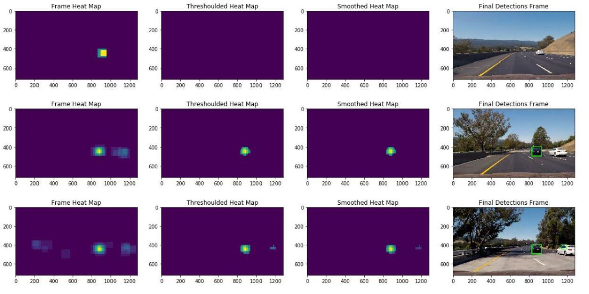
          <figcaption>
          

 
          </figcaption>
         </figure>

         <figure>
          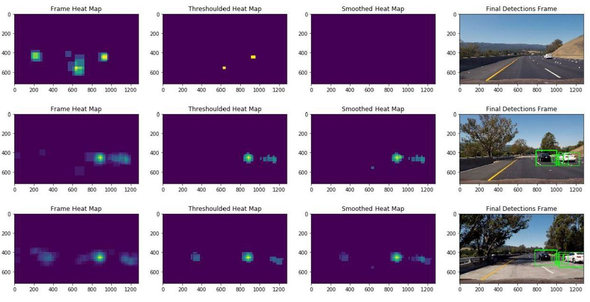
          <figcaption>
          

 
          </figcaption>
         </figure>
         
         <figure>
          
          <figcaption>
          

 
          </figcaption>
         </figure>

         <figure>
          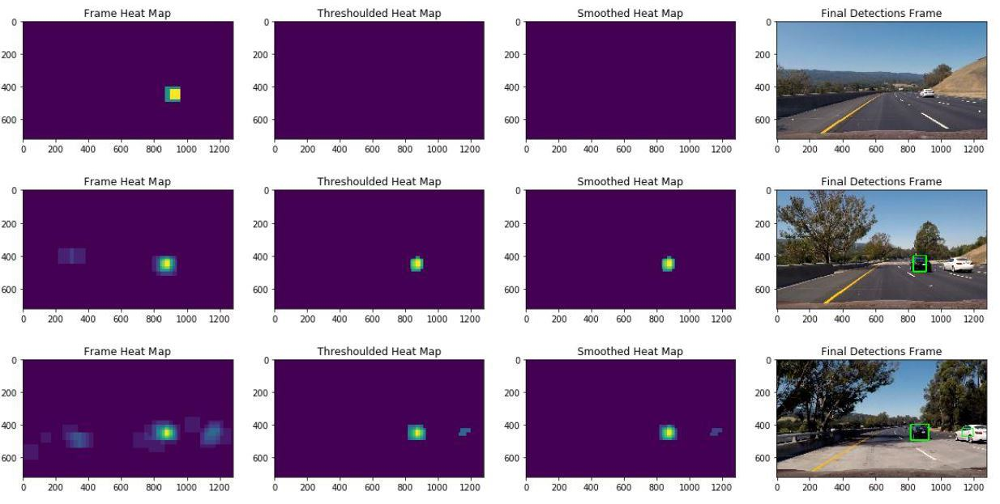
          <figcaption>
          

 
          </figcaption>
         </figure>

         <figure>
          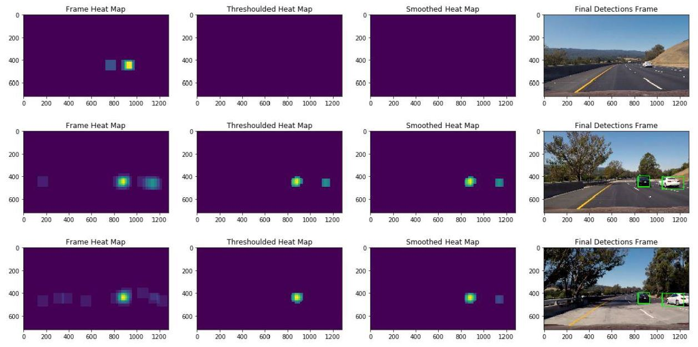
          <figcaption>
          

 
          </figcaption>
         </figure>

         <figure>
          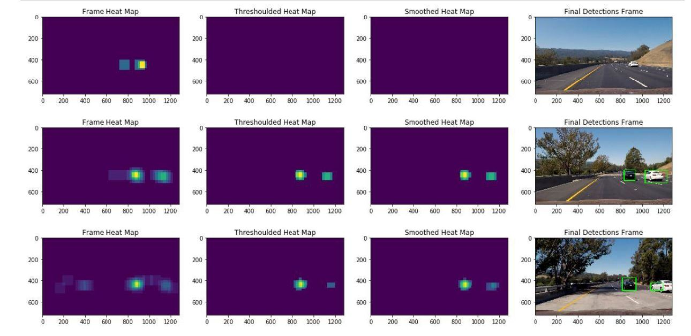
          <figcaption>
          

 
          </figcaption>
         </figure>
         
   - **Final Output Image:**
   
   <figure>
    
    <figcaption>
    

 
    </figcaption>
   </figure>
   
   
   - **Discussion**
   - **1. Briefly discuss any problems / issues you faced in your implementation of this project. Where will your pipeline likely fail? What could you do to make it more robust?**
      - Actually, I’ve listed all of the problems raised while implementing this pipeline and how I addressed each in Sliding Window Search section in this write-up but I’d mention here some of the short comings and future enhancements that may be added:
      Shortcomings & Future Enhancements:
         - 1- I’ve tried to merge the narrow bounding boxes but unfortunately the output was not mature enough to be integrated into this pipeline, so I believe that this may be a great future enhancement.
         - 2- Mainly the model was performing better in the black car detection than the white one and I believe that’s due to the training data contained more dark images than light ones (specifically in GTI) so I believe that adding more data or even augmenting the light images in the same used data (specifically in KITTI), would enhance the model performance.